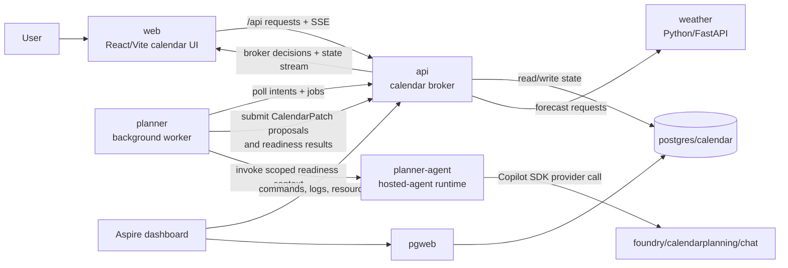

# Build 2026 Aspire agents demo

This repo is a compact Build 2026 demo for the thesis: **Aspire gives developers and agents a shared, executable model of the app.**

The app is a meeting-readiness planner. A user books or moves calendar items in a React UI; an Express broker validates calendar writes and records state; a background planner worker turns user intents and readiness jobs into broker-reviewed proposals; and a Foundry hosted-agent runtime uses the Copilot SDK to produce readiness suggestions without getting direct calendar-write authority.

## App shape

The executable model lives in [`apphost.mts`](./apphost.mts), with Aspire configuration in [`aspire.config.json`](./aspire.config.json). It defines:

| Resource | Role |
| --- | --- |
| `web` | React/Vite calendar assistant UI, published as a static website with `/api` routed to the API. |
| `api` | Express calendar broker, fake calendar provider, SSE state stream, readiness/proposal APIs, and demo commands. |
| `weather` | Python/FastAPI sidecar that returns deterministic meeting-day forecasts. |
| `postgres` / `calendar` | Aspire-managed PostgreSQL database for calendar state, readiness jobs, proposals, decisions, and audit history. |
| `pgweb` | Dashboard-launchable PostgreSQL inspection UI. |
| `planner` | Node background worker that polls the broker API for direct planning intents and readiness jobs. |
| `planner-agent` | Node hosted-agent runtime for local dev; published with `asHostedAgent(...)` as the Foundry hosted-agent runtime. |
| `foundry` / `calendarplanning` / `chat` | Azure AI Foundry project and GPT-5 mini model deployment used by the hosted agent. |
| `aca` | Azure Container Apps environment for deployable app services. |

Calendar-changing output always flows through structured `CalendarPatch[]` proposals. The broker validates ownership, calendar scope, operation type, etags, stale state, and confirmation policy before applying anything.

## Call flow



## Planner worker vs. planner-agent

- `planner` runs [`services/planner/src/worker.ts`](./services/planner/src/worker.ts). It has the broker-facing loops: direct calendar planning intents create `CalendarPatch[]` proposals, while readiness jobs gather scoped context from broker-approved API tools before invoking the hosted agent.
- `planner-agent` runs [`services/planner/src/agent.ts`](./services/planner/src/agent.ts). It serves the hosted-agent invocations protocol from [`hosted-agent-server.ts`](./services/planner/src/hosted-agent-server.ts) and calls the Copilot SDK/Foundry provider in [`copilot-foundry-client.ts`](./services/planner/src/copilot-foundry-client.ts). It returns readiness suggestions and optional patches, but never writes to the calendar.

The worker invokes the agent through `PLANNER_AGENT_ENDPOINT`, which the AppHost sets from `planner-agent`. Local calls do not need auth; deployed Foundry hosted-agent calls use Entra auth for `https://ai.azure.com/.default` and the `HostedAgents=V1Preview` feature header. Foundry session affinity is derived from the browser session and retained server-side.

## Run locally

Prerequisites:

- Node.js matching [`package.json`](./package.json): `^20.19.0 || ^22.13.0 || >=24`
- .NET 10 SDK and the Aspire CLI
- Python 3.12+ with `uv` for the weather sidecar in [`services/weather-python`](./services/weather-python)

```bash
npm install
aspire start
```

Use the Aspire dashboard URL printed by the CLI to open `web`, inspect resources, run resource commands, view logs/traces, and open `pgweb`.

The npm scripts are convenience wrappers around Aspire:

| Command | Runs | Use when |
| --- | --- | --- |
| `npm run dev` | `aspire start` | Normal local development from a single checkout. |
| `npm run dev:worktree` | `aspire start --isolated` | Running from a git worktree, running multiple checkouts at once, or avoiding shared local Aspire state. |

```bash
aspire stop
```

Local development has one supported entrypoint: the AppHost. Avoid starting individual services for the demo because Aspire wires resource URLs, health checks, Postgres, browser logs, telemetry, and startup ordering.

## Useful commands

```bash
npm run lint
npm run build
```

`npm run lint` checks the AppHost and runs TypeScript type checks across the workspaces. `npm run build` compiles the AppHost and builds workspace packages. There is no separate test script in this repo.

The Aspire dashboard exposes highlighted API commands from the AppHost:

- **Set demo calendar**: reset to the seeded Build 2026 scenario or generate a randomized Build-themed week.
- **Clear calendar**: remove calendar events and clear readiness/proposal state.

## Configuration

Aspire injects runtime service discovery through environment variables. Important ones include:

- `API_BASE_URL`: injected into `web` and `planner` from the `api` endpoint.
- `WEATHER_BASE_URL`: injected into `api` from the `weather` endpoint.
- `CALENDAR_STORE=postgres`: tells `api` to use the Aspire PostgreSQL database instead of the file fallback.
- `PLANNER_AGENT_ENDPOINT`: injected into `planner` from the `planner-agent` endpoint.
- `CALENDARPLANNING_URI` and `CHAT_MODELNAME`: injected into `planner-agent` through the Foundry model reference.

## Deploy

```bash
aspire deploy
```

The npm script is an alternative wrapper for the same Aspire command:

```bash
npm run deploy
```

Deployment uses the same AppHost. Stable services (`web`, `api`, `weather`, `planner`, Postgres/pgweb) target Azure Container Apps through `aca`; `planner-agent` is published as the Foundry hosted-agent runtime with the `invocations` protocol; and `foundry` / `calendarplanning` / `chat` provision the Azure AI Foundry backing resources.

Deploying requires Azure credentials and access to provision Azure Container Apps and Azure AI Foundry resources. The hosted-agent path uses `DefaultAzureCredential` for Foundry invocation/model access.

## Demo beats

1. Drag across an open calendar slot and book **Build keynote readiness review**.
2. Watch the readiness job progress through meeting details, 7-day calendar scan, Python weather, travel/setup, agenda/materials, hosted-agent invocation, and scoring.
3. Review suggestions for prep time, weather/attire, travel/setup, and agenda/materials.
4. Accept a calendar-changing suggestion and show the broker validating the agent's `CalendarPatch` before adding the prep or travel block.
5. Delete or move a meeting to show destructive or sensitive changes still require broker policy.
6. Open the Aspire dashboard to show the same executable model handles local orchestration, logs, telemetry, commands, data, and deployment.
